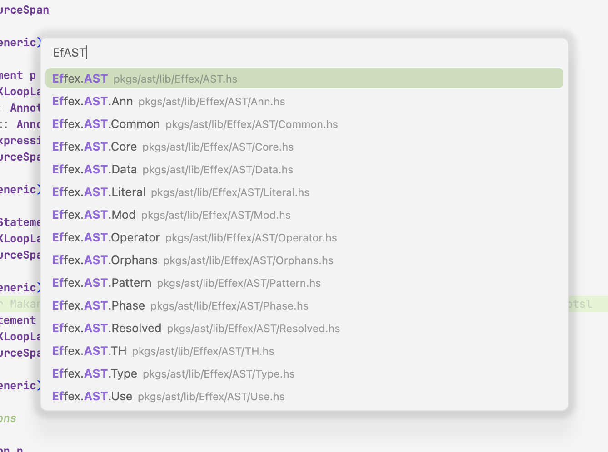

# VS Code Haskell Modules

This VS Code extension creates a cross-package tree of all Haskell modules it
can find. Extension ID `haskell-modules`. Published by `friedbrice`.

## Features

* __Cross-package module tree__ Easily jump to related modules, even in
  different packages, such as your unit tests and project dependencies.
  Navigate between modules, even in different packages, with ease.

  

* __Supports multiple `Main` modules__ `Main` modules appear in the module tree
  labelled by their filepath, rather than their module identifier.

* __Rename module__ Copies the contents of the current file to a new path and
  updates import lines in all your modules and your cabal file. Leaves the
  current file in place so GHCi won't get confused. Renaming Haskell modules on
  the fly has never been easier. _N.B. Does not yet replace imports._

  

* __Create submodule__ Pretty self-evident.

  

* __Jump to module__ Jump to the module under cursor. Even if it's in a
  project dependency.

  

* __Fuzzy search modules__ Quickly find and open any module in your workspace
  using fuzzy search. Access it via the search icon in the module tree view
  or the command palette (`Haskell Modules: Search module...`).

  

* __Hydrate/Dehydrate module__ Inserts qualified imports of all imported
  modules (hydrate). This greatly improves GHC feedback and suggestions.
  When done working on a module, qualified symbols introduced in this way can
  then be replaced with explicit imports (dehydrate). _N.B. Dehydrate is not
  implemented yet implemented._

  

## Limitations

### Incomplete Features

1.  Dehydrate is not yet implemented.

2.  Duplicating a module does not yet replac import statements in project
    modules.

### Project Dependencies

This extension will index your dependencies, but you need to download the source
files yourself. Fortunately, you can do this with Cabal.

```
mkdir deps
cabal get bytestring
mv bytestring-* deps
```

Name the directory whatever you'd like.

### Overloaded Module Identifiers

This extension assumes that each module file has a unique module identifier.
For example, if you have two files, `src/Data/Foo.hs` and `test/Data/Foo.hs`,
the extension's behavior is undefined. The one exception to this rule is for
modules whose module identifier is `Main`. `Main` is special-cased. Any `Main`
module will appear labelled by its file path as a child node of a node labelled
`Main` in the module tree. If your workspace has exactly one root, `Main`
modules will be labelled with the path relative to the workspace root.
Otherwise, `Main` modules will be labelled with their absolute path.

### Performance

Very large projects, or projects with very many dependencies, can impact VS Code
performance and power consumption. This extension has been used to work on
codebases of around 10,000 modules, and it's worked fine. At that scale, there
is a noticible, if slight, hit to battery life.

### Operators

The _Dehydrate_ feature does not work correctly with operators. Mostly because I
don't know how to write the appropriate regular expression.

## Contribute

Pleeeeeeease!

You see that section above, full of limitations?
